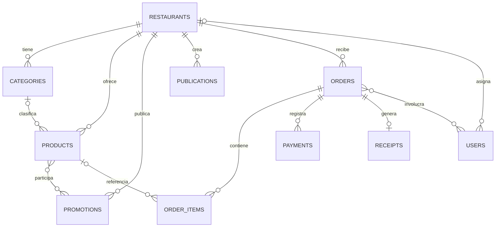
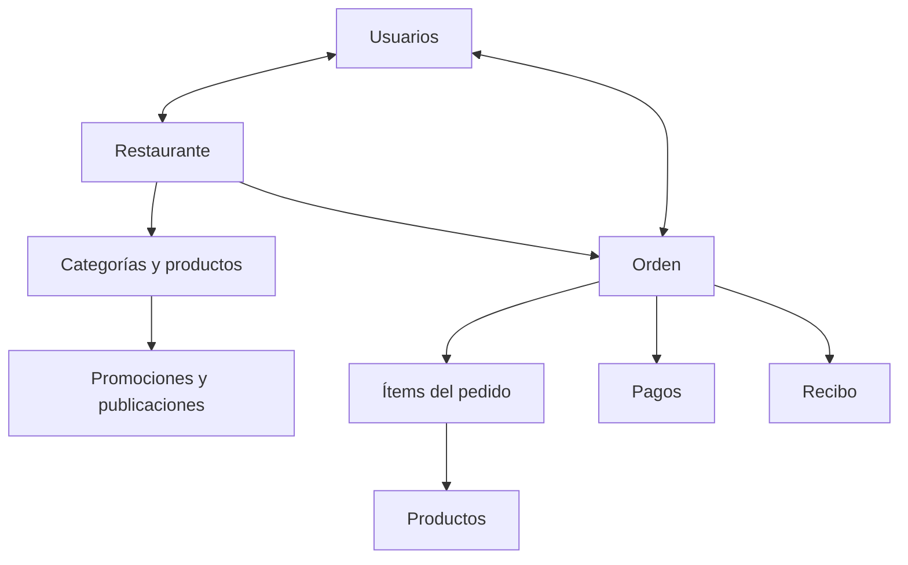

# Esquema de datos de Strapi — App multi-restaurante

## 1. Alcance del análisis

Documento generado a partir de los nueve archivos `schema.json` incluidos en `api.rar`.

- `categories`
- `orders`
- `order_items`
- `payments`
- `products`
- `promotions`
- `publications`
- `receipts`
- `restaurants`

Todos son `collectionType` y tienen `draftAndPublish: true`.

El RAR no incluye el esquema extendido de `plugin::users-permissions.user` ni los esquemas internos del plugin Upload. Por eso `USERS` y `MEDIA` aparecen como entidades externas. Tampoco se encontraron componentes ni zonas dinámicas.

## 2. Diagrama entidad–relación lógico

### Lectura rápida

- Un restaurante puede tener muchas categorías, productos, promociones, publicaciones, órdenes y usuarios.
- Una categoría puede agrupar muchos productos; cada producto puede tener como máximo una categoría.
- Un producto puede participar en muchas promociones y una promoción puede incluir muchos productos.
- Una orden contiene muchos ítems y puede registrar muchos pagos.
- Un producto puede aparecer en muchos ítems de pedido.
- Una orden puede tener como máximo un recibo.
- Una orden puede estar relacionada con muchos usuarios y un usuario con muchas órdenes.

Las relaciones que no están marcadas como `required` en Strapi son opcionales, aunque la cardinalidad del modelo indique `manyToOne`, `oneToMany`, `oneToOne` o `manyToMany`.

## 3. Mapa de relaciones

| Origen | Campo | Cardinalidad | Destino | Campo inverso | Implementación declarada |
|---|---|---:|---|---|---|
| `categories` | `restaurant` | N:1 | `restaurants` | `categories` | `manyToOne` / `inversedBy` |
| `categories` | `products` | 1:N | `products` | `category` | `oneToMany` / `mappedBy` |
| `orders` | `restaurant` | N:1 | `restaurants` | `orders` | `manyToOne` / `inversedBy` |
| `orders` | `order_items` | 1:N | `order_items` | `order` | `oneToMany` / `mappedBy` |
| `orders` | `payments` | 1:N | `payments` | `order` | `oneToMany` / `mappedBy` |
| `orders` | `users` | N:M | Users & Permissions | `orders` | `manyToMany` / `mappedBy` |
| `order_items` | `product` | N:1 | `products` | `order_items` | `manyToOne` / `inversedBy` |
| `payments` | `order` | N:1 | `orders` | `payments` | `manyToOne` / `inversedBy` |
| `products` | `restaurant` | N:1 | `restaurants` | `products` | `manyToOne` / `inversedBy` |
| `products` | `category` | N:1 | `categories` | `products` | `manyToOne` / `inversedBy` |
| `products` | `promotions` | N:M | `promotions` | `products` | `manyToMany` / `mappedBy` |
| `products` | `order_items` | 1:N | `order_items` | `product` | `oneToMany` / `mappedBy` |
| `promotions` | `restaurant` | N:1 | `restaurants` | `promotions` | `manyToOne` / `inversedBy` |
| `promotions` | `products` | N:M | `products` | `promotions` | `manyToMany` / `inversedBy` |
| `publications` | `restaurant` | N:1 | `restaurants` | `publications` | `manyToOne` / `inversedBy` |
| `receipts` | `order` | 1:1 | `orders` | No declarado | Relación unidireccional |
| `restaurants` | `users` | 1:N | Users & Permissions | `restaurant` | `oneToMany` / `mappedBy` |

## 4. Diccionario de tablas

### `restaurants` — Restaurant

Entidad raíz para separar los datos de cada restaurante.

| Campo | Tipo Strapi | Restricciones / valores | Observación |
|---|---|---|---|
| `name` | string | required | Nombre del restaurante |
| `slug` | uid | targetField: `name` | Identificador legible en URL |
| `description` | text | opcional | Descripción general |
| `email` | email | required | Correo del restaurante |
| `address` | text | opcional | Dirección |
| `phone` | string | opcional | Teléfono |
| `nit` | string | opcional | NIT |
| `statusRes` | enumeration | `ACTIVE`, `INACTIVE`, `SUSPENDED` | Estado del restaurante |
| `logo` | media, single | opcional | Acepta imágenes, archivos, videos y audios |
| `coverImage` | media, single | opcional | Acepta imágenes, archivos, videos y audios |
| `users` | relation | 1:N | Inversa de `user.restaurant` |
| `categories` | relation | 1:N | Inversa de `category.restaurant` |
| `products` | relation | 1:N | Inversa de `product.restaurant` |
| `promotions` | relation | 1:N | Inversa de `promotion.restaurant` |
| `publications` | relation | 1:N | Inversa de `publication.restaurant` |
| `orders` | relation | 1:N | Inversa de `order.restaurant` |

### `categories` — Category

| Campo | Tipo Strapi | Restricciones / valores | Observación |
|---|---|---|---|
| `name` | string | required | Nombre de la categoría |
| `description` | text | opcional | Descripción |
| `image` | media, single | opcional | Acepta imágenes, archivos, videos y audios |
| `isActive` | boolean | default: `true` | Habilitación lógica |
| `restaurant` | relation | N:1 | Restaurante propietario |
| `products` | relation | 1:N | Productos de la categoría |

### `products` — Product

| Campo | Tipo Strapi | Restricciones / valores | Observación |
|---|---|---|---|
| `name` | string | required | Nombre del producto |
| `slug` | uid | targetField: `name` | Identificador legible |
| `sku` | string | unique | Código único de inventario |
| `description` | text | opcional | Descripción |
| `price` | decimal | required, default: `0` | Precio vigente |
| `stock` | integer | default: `0` | Existencia |
| `isAvailable` | boolean | default: `true` | Disponibilidad |
| `mainImage` | media, single | opcional | Imagen principal |
| `gallery` | media, multiple | opcional | Galería del producto |
| `restaurant` | relation | N:1 | Restaurante propietario |
| `category` | relation | N:1 | Categoría |
| `promotions` | relation | N:M | Promociones aplicables |
| `order_items` | relation | 1:N | Ítems históricos asociados |

### `promotions` — Promotion

| Campo | Tipo Strapi | Restricciones / valores | Observación |
|---|---|---|---|
| `name` | string | required | Nombre de la promoción |
| `description` | text | opcional | Detalle |
| `type` | enumeration | `PERCENTAGE`, `FIXED_AMOUNT`, `TWO_FOR_ONE` | Tipo de descuento |
| `percentage` | decimal | required, default: `0` | Porcentaje; actualmente obligatorio para todos los tipos |
| `discountAmount` | decimal | opcional | Importe fijo |
| `buyQuantity` | integer | opcional | Cantidad que se compra |
| `payQuantity` | integer | opcional | Cantidad que se paga |
| `startAt` | datetime | opcional | Inicio de vigencia |
| `endAt` | datetime | opcional | Fin de vigencia |
| `restaurant` | relation | N:1 | Restaurante propietario |
| `products` | relation | N:M | Productos incluidos |

### `publications` — Publication

| Campo | Tipo Strapi | Restricciones / valores | Observación |
|---|---|---|---|
| `title` | string | required | Título |
| `description` | text | required | Contenido |
| `image` | media, single | opcional | Recurso principal |
| `featured` | boolean | opcional | Publicación destacada |
| `restaurant` | relation | N:1 | Restaurante propietario |

### `orders` — Order

| Campo | Tipo Strapi | Restricciones / valores | Observación |
|---|---|---|---|
| `orderCode` | string | required, unique | Código único de pedido |
| `orderType` | enumeration | `ONLINE`, `COUNTER`, `DELIVERY`, `PICKUP` | Canal/tipo de pedido |
| `statusOrder` | enumeration | `PENDING`, `CONFIRMED`, `PREPARING`, `READY`, `COMPLETED`, `CANCELLED` | Flujo operativo |
| `paymentStatus` | enumeration | `PENDING`, `PARTIAL`, `PAID`, `REFUNDED` | Estado de cobro consolidado |
| `subtotal` | decimal | required | Subtotal |
| `discount` | decimal | default: `0` | Descuento total |
| `total` | decimal | required, default: `0` | Total final |
| `orderedAt` | datetime | required | Fecha del pedido |
| `completeAt` | datetime | opcional | Fecha de finalización |
| `restaurant` | relation | N:1 | Restaurante que recibe la orden |
| `order_items` | relation | 1:N | Detalle del pedido |
| `payments` | relation | 1:N | Pagos aplicados |
| `users` | relation | N:M | Usuarios asociados |

### `order_items` — OrderItem

| Campo | Tipo Strapi | Restricciones / valores | Observación |
|---|---|---|---|
| `quantity` | integer | required, default: `0` | Cantidad |
| `unitPrice` | decimal | required | Precio unitario congelado |
| `discount` | decimal | default: `0` | Descuento del ítem |
| `subtotal` | decimal | required | Subtotal del ítem |
| `productName` | string | required | Nombre congelado para conservar historial |
| `order` | relation | N:1 | Orden padre |
| `product` | relation | N:1 | Producto original |

### `payments` — Payment

| Campo | Tipo Strapi | Restricciones / valores | Observación |
|---|---|---|---|
| `amount` | decimal | required | Importe pagado |
| `method` | enumeration | `CASH`, `QR`, `CARD`, `TRANSFER` | Medio de pago |
| `statusPayment` | enumeration | `PENDING`, `APPROVED`, `REJECTED`, `REFUNDED` | Estado del pago |
| `transactionReference` | string | opcional | Referencia externa |
| `paidAt` | datetime | required | Fecha del pago |
| `order` | relation | N:1 | Orden pagada |

### `receipts` — Receipt

| Campo | Tipo Strapi | Restricciones / valores | Observación |
|---|---|---|---|
| `receiptNumber` | string | required, unique | Número único |
| `issuedAt` | datetime | required | Fecha de emisión |
| `subtotal` | decimal | required | Subtotal documentado |
| `discount` | decimal | default: `0` | Descuento documentado |
| `total` | decimal | required | Total documentado |
| `completeName` | text | opcional | Nombre o razón social |
| `ci` | string | opcional | Documento de identidad |
| `order` | relation | 1:1 | Relación unidireccional con la orden |

## 5. Entidades externas e internas de Strapi

### Users & Permissions

Los esquemas analizados apuntan a `plugin::users-permissions.user` mediante:

- `restaurant.users` ↔ `user.restaurant`: un restaurante tiene muchos usuarios y un usuario puede pertenecer a un restaurante.
- `order.users` ↔ `user.orders`: muchos usuarios pueden relacionarse con muchas órdenes.

Para validar completamente estas dos relaciones hace falta el archivo de extensión del modelo User, normalmente ubicado en una ruta semejante a:

`src/extensions/users-permissions/content-types/user/schema.json`

### Upload / Media

Los campos `logo`, `coverImage`, `image`, `mainImage` y `gallery` se enlazan con el plugin Upload. Strapi crea y administra sus tablas y tablas de enlace internamente.

### Campos automáticos

Strapi agrega metadatos técnicos que no aparecen como atributos de negocio en estos `schema.json`, por ejemplo identificadores y campos de creación, modificación y publicación. Como todos los Content Types tienen Draft & Publish activo, también existe estado de borrador/publicación.

## 6. Tablas de enlace esperadas

El modelo exige relaciones que Strapi persiste mediante columnas o tablas de enlace internas, según el tipo de relación y el conector de base de datos:

- `products` ↔ `promotions` — N:M.
- `orders` ↔ `users` — N:M.
- Los enlaces de campos Media con archivos del plugin Upload.
- Enlaces para las relaciones 1:N y 1:1 administradas por Strapi.

Los nombres físicos exactos de estas tablas internas no pueden confirmarse únicamente con los `schema.json`; deben verificarse contra el archivo SQLite o el esquema real de la base de datos generada.

## 7. Observaciones para revisar antes de cerrar el backend

1. **Falta el modelo User extendido en el RAR.** Debe contener, al menos, las contrapartes `restaurant` y `orders` para que las relaciones declaradas con `mappedBy` sean válidas.
2. **`receipt.order` no declara `inversedBy` ni existe `order.receipt`.** La relación funciona como unidireccional, pero conviene decidir si la orden debe exponer directamente su recibo.
3. **Las relaciones principales no están marcadas como obligatorias.** Strapi permitiría, por ejemplo, productos sin restaurante/categoría u órdenes sin restaurante si no se valida en controladores o servicios.
4. **Draft & Publish está habilitado en datos transaccionales.** Conviene confirmar si órdenes, ítems, pagos y recibos realmente deben manejar borradores.
5. **`percentage` es obligatorio para toda promoción.** Incluso `FIXED_AMOUNT` y `TWO_FOR_ONE` requieren el campo, aunque tenga valor `0`.
6. **`paidAt` es obligatorio aun cuando el pago esté `PENDING` o `REJECTED`.** Puede ser preferible hacerlo opcional hasta la aprobación.
7. **`quantity` tiene valor inicial `0`.** Para un ítem de pedido normalmente debería validarse como mínimo `1`.
8. **Los campos denominados como imagen aceptan cualquier tipo de medio.** Si solo deben aceptar imágenes, hay que limitar `allowedTypes` a `images`.
9. **Revisar el nombre `completeAt`.** Si representa una fecha de finalización, `completedAt` suele ser más claro y consistente.

## 8. Vista funcional del flujo

---

Fuente: estructura Strapi contenida en `api.rar`, analizada el 19 de agosto de 2026.
